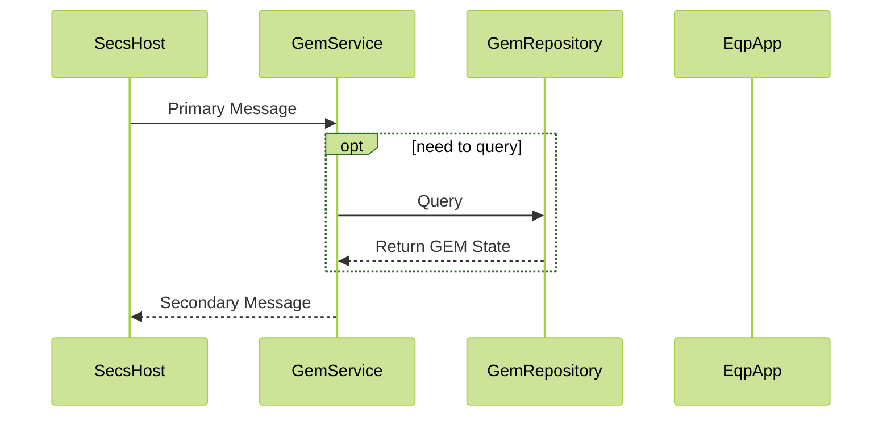
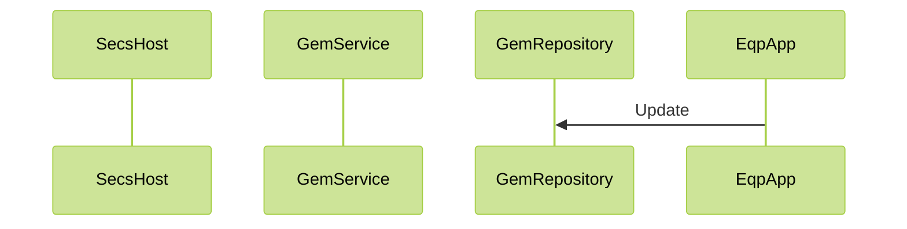
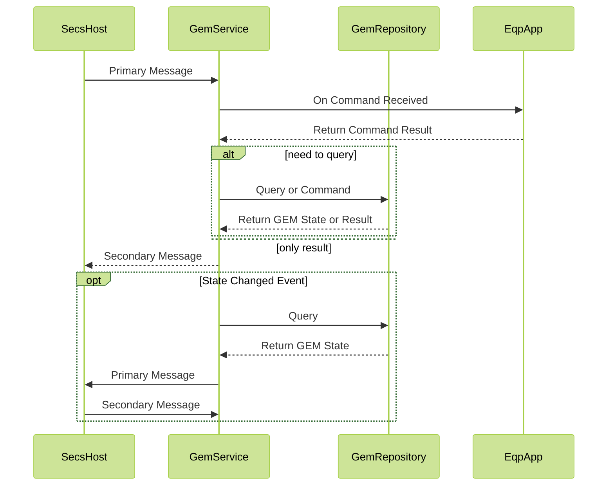
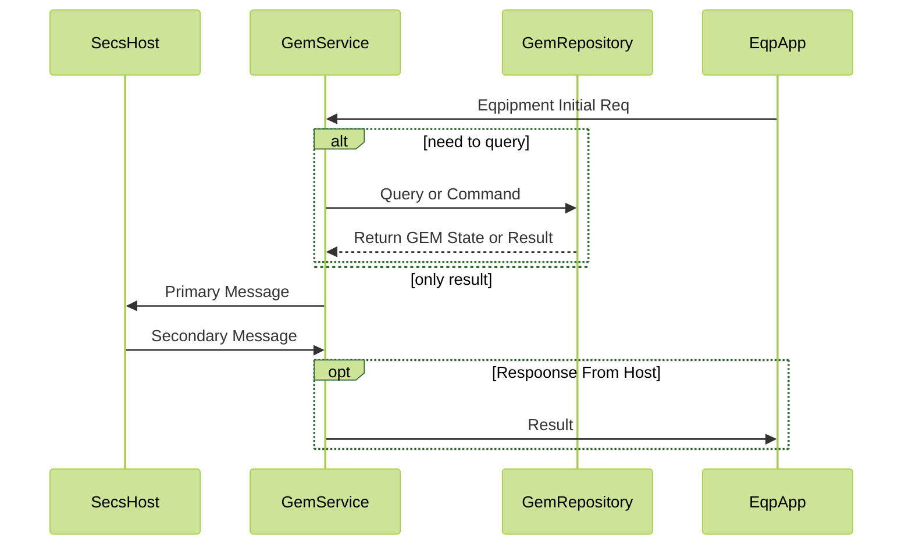
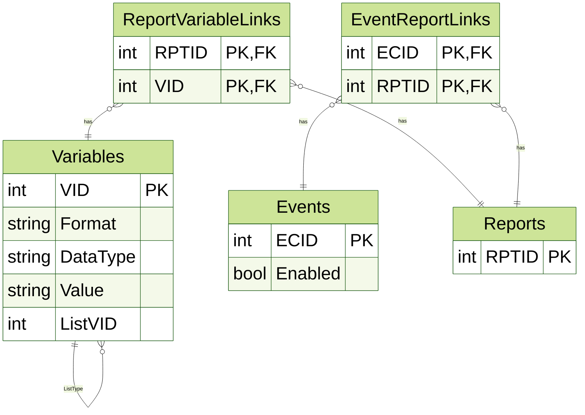

# Gem4Net
- 依賴套件
  - [secs4net](https://github.com/mkjeff/secs4net)
    - HSMS, Tx TimeOut
    - S9系列
  - SQLite + EF Core + Dapper

## 測試資料
### Variables
## Todo
- 把SecsFormat改為和Secs4Net的enum一樣, 開始處理binary
- GemService參數整理成Option
- ProcessProgram 格式還是二維比較好
## 已完成SECS語句
- [x] S1F1  Are You There
- [x] S1F3  Selected Equipment Status Request
- [ ] S1F5  Formatted Status Request (FSR)
- [x] S1F11 Status Variable Namelist Request
- [X] S1F13 Establish Communications Request
- [X] S1F15 Request OFF-LINE
- [X] S1F17 Request ON-LINE
- [ ] S1F21 Data Variable Namelist Request
- [X] S2F13 Equipment Constant Request
- [X] S2F15 New Equipment Constant Send
- [ ] S2F17 Date and Time Request
- [ ] S2F21 Remote Command Send (RCS)
- [x] S2F23 Trace Initialize Send
- [X] S2F25 Loopback Diagnostic Request
- [ ] S2F29 Equipment Constant Namelist Request
- [ ] S2F31 Date and Time Set Request
- [X] S2F33 Define Report
- [X] S2F35 Link Event Report
- [X] S2F37 Enable/Disable Event Report
- [X] S2F41 Host Command Send
- [X] S5F1 Alarm Report Send
- [x] S5F3 Enable/disable Alarm Send
- [x] S5F5 List Alarms Request
- [x] S5F7 List Enable Alarm Request
- [x] S6F1  Trace Data Send
- [X] S6F11 Event Report Send
- [ ] S6F13 Annotated Event Report Send
- [X] S6F15 Event Report Request
- [ ] S6F17 Annotated Event Report Request
- [x] S6F19 Individual Report Request
- [ ] S7F1 Process Program Load Inquire
- [ ] S7F3 Process Program Send
- [ ] S7F5 Process Program Reques
- [X] S7F17 Delete Process Program Send
- [X] S7F19 Current Process Program Dir Request
- [X] S7F23 Formatted Process Program Send
- [X] S7F25 Formatted Process Program Request
- [X] S10F1 Terminal Request
- [X] S10F3 Terminal Display, Single
- [ ] S10F5 Terminal Display, Multi-Block (VTN)
### Variable Item Dictionary in SEMI E5 (8.4)
### GEM-Defined Collection Events (9.3)
### App Configs
- CommHostEqpTrigger
## ITRI-like Interface
- [ ] Initialize: 建構式加callback?
- [ ] Close: 外部可 Enable, Disable
- [ ] ProcessMessage: 直接把Secs4Net拿來用...
- [X] UpdateSV: SV,DV,EC混在一起?
- [ ] GetSV
- [X] UpdateEC
- [ ] GetEC
- [X] SendTerminalMessage
- [X] EventReportSend
- [ ] AlarmReportSend
- [X] EnableComm
- [X] DisableComm
- [X] GetCurrentCommState
- [X] OnLineRequest
- [X] OffLine
- [X] OnLineLocal
- [X] OnLineRemote
- [ ] Command: 這個應該有細分空間
## 架構說明
### 查詢類型語句
不會改變資料狀態,例如S1F1,S1F3,S2F13

### 更新設備狀態變數

### 指令類型語句
會改變設備或資料狀態的語句,例如S2F15,S2F33,S2F41,S7F23

### 設備主動語句
設備主動發起,例如S6F11, S5F1, S10F1

## Data Model

